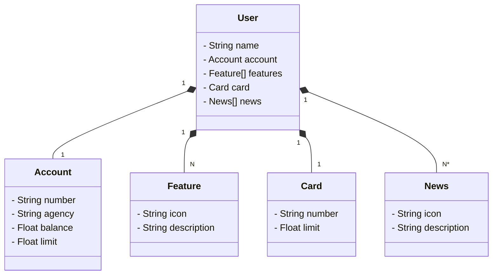

# Project Java API RESTful
Java RESTful API - Created in the DIO Course

### Main Technologies

- **Java 17**: We will use the latest LTS version of Java to take advantage of the latest innovations that this robust and widely used language offers;
- **Spring Boot 3**: We will work with the newest version of Spring Boot, which maximizes developer productivity through its powerful self-configuration premise;
- **Spring Data JPA**: We will explore how this tool can simplify our data access layer, facilitating integration with SQL databases;
- **OpenAPI (Swagger)**: Let's create effective and easy-to-understand API documentation using OpenAPI (Swagger), perfectly aligned with the high productivity that Spring Boot offers;
- **Railway**: It facilitates the deployment and monitoring of our cloud solutions, in addition to offering several databases as a service and CI/CD pipelines.
  
## Class Diagram

